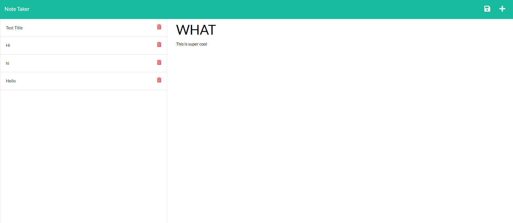
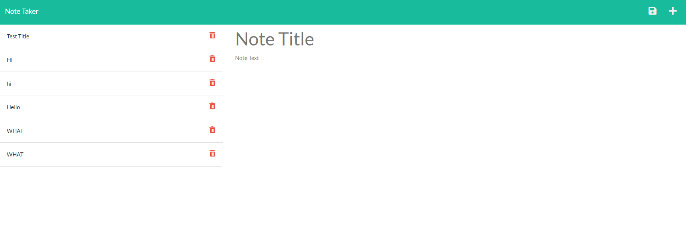

# Notepad-Application

Link to deployment:
>Heroku Deployment Coming Soon! (the heroku site is currently down)

## Description
    For this homework assignment we are tasked with creating the back-end of a given application with an already built front end. The application is a Note Taker to write and save notes.

Acceptance Criteria:

    GIVEN a note-taking application
    WHEN I open the Note Taker
    THEN I am presented with a landing page with a link to a notes page
    WHEN I click on the link to the notes page
    THEN I am presented with a page with existing notes listed in the left-hand column, plus empty fields to enter a new note title and the note’s text in the right-hand column
    WHEN I enter a new note title and the note’s text
    THEN a Save icon appears in the navigation at the top of the page
    WHEN I click on the Save icon
    THEN the new note I have entered is saved and appears in the left-hand column with the other existing notes
    WHEN I click on an existing note in the list in the left-hand column
    THEN that note appears in the right-hand column
    WHEN I click on the Write icon in the navigation at the top of the page
    THEN I am presented with empty fields to enter a new note title and the note’s text in the right-hand column

## Screenshots:
Video of how application works
>https://drive.google.com/file/d/10V9xZMlNwouceW1QxMYQnXKRMnXTg_KN/view?usp=sharing

Webpage:

##  Installation
  Instruction for installing and running project:

*   In your terminal run the command 'npm install' and then the command 'node server.js' to begin the server.
*   in the command line you will be given a link where you can interact with the application in browser.
*   the application will also be deployed on Heroku, but at the moment the site is down. COMING SOON
